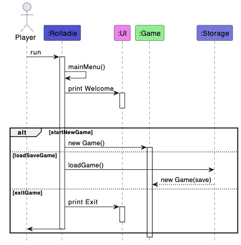
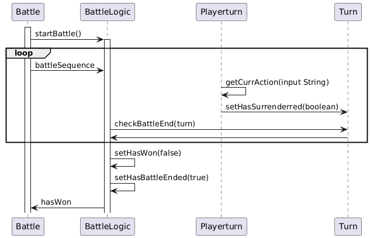
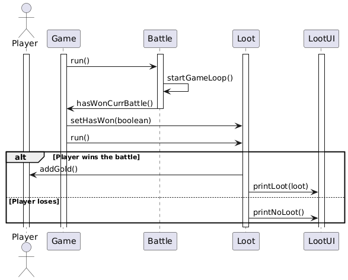

# RollaDie Developer Guide  

## Acknowledgement
This project was made possible with the help of the listed tools below:
- Junit (Provides a robust testing framework)
- Gradle (Simplifying dependency management and automating the build process)


## Setting Up and Getting Started    

Follow these steps to set up and run the Game on your local machine.      

### Prerequisites 
Ensure you have the following installed:
- Intellij IDEA (highly recommended)
- Java 17 (Required to run the application)
- Gradle (Used for dependency management and building the project)

### Step 1: Fork and Clone the Repository       
1. **Fork** the repository to your GitHub account.
2. **Clone** the forked repository to your local machine using:
```
git clone https://github.com/AY2425S2-CS2113-T13-4/tp.git
```

### Step 2: Import the Project into IntelliJ IDEA
1. Open IntelliJ IDEA.
2. Click File > Open and select the cloned project folder.
3. When prompted, import the project as a Gradle project.
4. Wait for the dependencies to be downloaded.


## Design

## Architecture 
        

The Architecture diagram given above explain the high-level design of the application.      


### Class Structure
```
+---main
|   └── java
+---Exceptions  
|   └── RolladieException.java  
|  
+---Functionalities  
|   ├── Parser.java  
|   ├── Storage.java  
|   └── ui  
|       ├── UI.java  
|       ├── BattleUI.java  
|       ├── LootUI.java  
|       └── ShopUI.java  
|  
+---Game  
|   ├── Game.java  
|   ├── Rolladie.java  
|   ├── RollDice.java  
|   ├── actions  
|   │   ├── Action.java  
|   │   ├── DefaultAction.java  
|   │   ├── ExitAction.java  
|   │   ├── HelpAction.java  
|   │   ├── StartAction.java  
|   │   ├── BattleAction (Attack, Defend, Flee)  
|   │   └── ShopAction (Buy, Sell, Leave)  
|   ├── characters (Player, Enemy, EnemyDatabase)  
|   ├── currency (Gold)  
|   ├── equipment (Armor, Boots, Weapons, Databases)  
|   ├── events  
|   │   ├── Event.java  
|   │   ├── Battle (Battle, BattleLogic, Turns)  
|   │   ├── Loot (Loot)  
|   │   └── Shop (Shop)  
|   └── menu (Menu, MenuSystem, TerminalUtils)  
└── seedu

```

## Component Details {To be Updated}

### 1. Main component
Main (consisting of classes `RollaDie`) is in charge of the app launch and shut down.     
- At app launch, it initializes the other components in the proper sequence and establishes their connections.       
- At shut down, it deactivates the other components and invokes cleanup methods as needed.  

The bulk of the app’s work is done by the following components:
- `Functionalities`: Designed for enhancing user interactions such as reading and printing messages to and from terminal.
- `Game`: Manipulate major gameplay mechanics.
- `Storage`: Manages saving and loading data to and from the hard disk.        
- `Exception`: Handle Exceptions.

### 2. Functionalities component     
{To be updated}       
### 3. Game component       
{To be updated}       

### 4. Storage component
The Storage Component is responsible for saving and loading Game progress.
It reads and writes Game data to a text file (savefile.txt),
ensuring that players can resume their Game after closing the application.         

The Storage class includes the following Functionalities:
1. Save the Game:

- The `saveGame(Player, Event, Queue<Event>)` method writes player stats, the current event,
and upcoming events to a file.    
- It converts Game objects into a text format using their `toText()` methods.

2. Load the Game:

- The `loadGame()` method reads the save file and reconstructs the Game state.
- It calls helper methods `parseCharacterFromText()` and `parseEventFromText()` to convert text data back into objects.
- If the save file is missing or corrupted, it creates a new Game instance.

3. Data Parsing:

- `parseCharacterFromText()` deciphers character stats (health, attack, defense, etc.) from text.
- `parseEventFromText()` reconstructs different Game events, such as battles, from saved data.


### 5. Exception component
- Includes helper classes that support other components.
- Exceptions: Contains `RolladieException.java` for handling custom errors.
- Parsers & Helpers: Includes Parser.java for reading user input.


  
## Implementation
## Key Features

### 1. Save and Load
**Overview**    
The Save and Load feature in Rolladie is an important part of the game as it allows players to not lose
their progress in the game. When the player starts the game, he is brought to the main menu, which allows him
to select between Start Game, Load Game and Exit. If the player chooses to start the game, he automatically starts
a new game. If the player chooses to load game, he will be able to choose a save slot to load from.

**Implementation Details**     
The Save and Load feature in RollaDie handles the storage of all player information and battle information.
1. The process begins with the player booting up the game.
2. The player will be greeted by the main menu, allowing the player to choose from 1-3, where 1 is
Start Game, 2 is Load Game and 3 is exit game.
3. If player chooses 1, a new Game object is created where player starts a new game.
4. If player chooses 2, loadGame() in the Storage class will be called to fetch the serialised data, which
is processed to load the game information, and initialise a new Game object based on the data fetched.
5. If player chooses 3, the game exits itself.
6. After every loot and shop event, the game also presents the users with an opportunity to save the game.
7. If the player selects "y", the game prompts the user to choose from 1-3 to save to a save slot, else 
if player selects "n", game does not save.

**Sequence Diagram**         
     
The sequence diagram below illustrates the process that occurs when the game boots and prompts user to load.



### 2. Attack       
**Overview**    
        
The Attack Feature in RollaDie is a core component of the Game's battle system, 
allowing the player and enemy to take turns attacking each other. The feature manages input handling, 
attack calculations, and battle progression.
- During the player's turn, the Game reads the player's command, 
determines the action, cooldown, power, and roll dice to calculate attack bonuses. 
If the player chooses to attack, the attack is executed, and damage is applied to
the enemy. The Game then prints the attack message and checks if the battle has ended.      
- The player can choose from the numbers provided on screen to choose different attacks during his turn.
- During the enemy's turn, the enemy follows a similar process which is attacking the player, applying damage, 
and displaying attack messages. The Game continues alternating between player and 
enemy turns until either the player or the enemy is defeated. This feature ensures smooth battle flow,
handles attack mechanics, and updates battle status dynamically, keeping the combat engaging and strategic.


**Implementation Details**     
        
The Attack Feature in RollaDie handles the player's and enemy's turn-based combat interactions. 
1. The process begins with the player's turn, where the user enters a command,
which is read and parsed by the player class.  
2. The parsed command is processed by Player, which sets chosen ability based on the command parsed.       
3. If the player's attack requires power, deduct the required power. If power is insufficient, return invalid attack.
4. The player’s attack chosen will start its cooldown is sent to the **Battle** class where 
the attack will be stored as the player's ability chosen. The enemy will then choose ability based on 
chooseAIAction() method in Player class.
5. Both player and enemy will then roll dices to determine the damage that they do based on the formula: damage =
[(dice roll result) + (num of dice) * (weapon bonus) - (opponent armor defense)] * [(power) / (max power) * 0.5 * (ability damage multiplier)].
5. Both the player and enemy will then carry out their move and attack each other, deducting both characters' health based on damage formula.
6. Cooldown of all abilities decreases by 1.
7. This loop repeats until the battle ends.

**Sequence Diagram**         
     
The sequence diagram below illustrates the process that occurs when the player inputs an attack command.


### 3. Heal        
**Overview**

The heal Feature in RollaDie allows players to adopt a heal during their turn instead of attacking.
This feature enhances strategic gameplay by giving the player an option to heal and recover both
health and power which is needed for casting skills.The battle sequence continues until either 
the player or the enemy is defeated.

**Implementation Details**   
The implementation is generally very similar to the attack feature above, with the only difference being the action used.

During the player’s turn:
1. The user inputs command "2", which is the heal action.
2. The parsed command is processed by Player, which sets chosen heal ability based on the command parsed.      
3. The heal action will start its cooldown and is sent to the **Battle** class where the heal action
is stored as the player's ability chosen. The enemy will also choose an ability.
4. Only the enemy rolls a die and the player will be healed for a flat amount of health. The enemy will deal damage
based on die roll while the player will heal a fixed amount.

**Sequence Diagram**        

The sequence diagram is shared with the attack feature above.


### 4. Flee        
**Overview**      
The flee feature in Rolladie is to allow the player to escape from nasty situations.
This feature allows players to make a strategic retreat to re gear up before fighting strong enemies.
When the player chooses to flee, the battle ends immediately and the player goes onto the next event.

**Implementation Details**          
1. During the player's turn, **PlayerTurn** class gets the current action of player.
2. If player chooses to flee, **PlayerTurn** sets hasSurrendered in **Turn** to true.
3. **BattleLogic** checks if hasSurrendered in **Turn** is true and sets hasWon to false and hasBattleEnded to true.
4. **BattleLogic** returns hasWon = false to **Battle** class to end the battle.

**Sequence Diagram**          



### 5. Loot      
**Overview**
The loot feature in Rolladie allows the player to get gold after winning a battle.
This feature enables players to earn gold to upgrade himself in the shop.
If player does not win battle, he does not get gold.

**Implementation Details**
1. After the battle, **Battle** object will send hasWon to **Game** to set the hasWonCurrBattle in Game to true
or false depending on whether the player won or fled from the battle.
2. **Game** sets the hasWon variable in **Loot** based on hasWonCurrBattle.
3. If hasWon in **loot** is true, add gold to player and print the loot that the player got.
4. If hasWon in **loot** is false, print that the player got no loot.

**Sequence Diagram**



### 5. Load        
{To be Updated}          

**Overview**

**Implementation Details**

**Sequence Diagram**

### 6. Save       
{To be Updated}            
**Overview**

**Implementation Details**

**Sequence Diagram**


### 7. Shop
{To be Updated}       
**Overview**

**Implementation Details**

**Sequence Diagram**

### 8. Loot
{To be Updated}       
**Overview**

**Implementation Details**

**Sequence Diagram**


## Appendix

## Product scope

### Target user profile:

RollaDie is designed for CS2113 students who want a fun and simple way to relax, 
and to enjoy the easy-to-use text-based interface and clear Game rules.
The Game is also great for DnD fans who like turn-based battles, strategy, and storytelling,
without the hassle of setting up a full Game.

### Value proposition:

RollaDie is a fun and nostalgic text-based RPG that brings the adventurous spirit of Dungeon & Dragons (DnD)
to life in a simple way.  It brings the excitement of classic role-playing games to a simple 
Command Line Interface (CLI), making it lightweight and easy to play anytime, anywhere.
Instead of dealing with complicated setups, players can jump straight into the action,
rolling dice, battling enemies, and making crucial choices.

## User Stories
***

| Version | As a ...        | I want to ...                                         | So that I can ...                   |
|---------|-----------------|-------------------------------------------------------|-------------------------------------|
| v1.0    | student player  | attack during the battle phase                        | deal damage to enemy.               | 
| v1.0    | student player  | defend during the battle phase                        | reduce the damage taken.            |
| v1.0    | student player  | fight enemies                                         | collect points for a final score.   |
| v1.0    | student player  | input simple commands ( attack, defend )              | get used to the controls.           |
| v1.0    | student player  | see my health bar                                     | better decide my next move.         |
| v2.0    | student player  | save Game progress                                    | continue my Game.                   |
| v2.0    | student player  | roll dice                                             | determine the outcome of an action. |
| v2.0    | student player  | fight different enemies with different battle effects | make the journey more dynamic.      |
| v2.0    | student player  | change my equipment                                   | determine the outcome of an action. |
| v2.0    | student player  | collect points                                        | upgrade my equipment.               |

## Non-Functional Requirements
1. Should work on any mainstream OS as long as it has Java 17 or above installed.
2. This Game is designed as a single-player experience.
3. This Game is optimized for users with an average typing speed.


## Testing        
{To be Updated}

### Structure
Tests are organized according to the package structure:

```
+---data
|   \---StorageTest
|           ValidData.txt
|           
\---java
+---Game
|   |   GameTest.java
|   |   RolladieTest.java
|   |   RollDiceTest.java
|   |   
|   +---Battle
|   |       BattleTest.java
|   |       
|   +---Characters
|   |       CharacterTest.java
|   |       
|   \---Functionalities
|           UITest.java
|           
\---seedu
\---duke

```


## Glossary
* *User* - A person who plays the Game.
* *Mainstream OS* -  Windows, Linux, Unix, MacOS