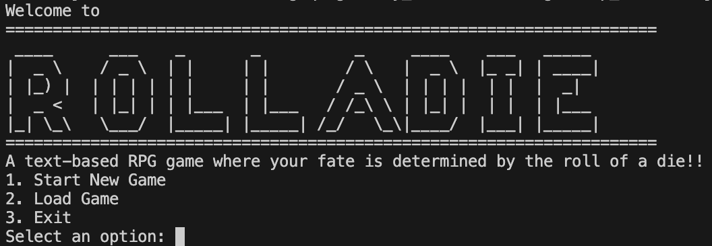
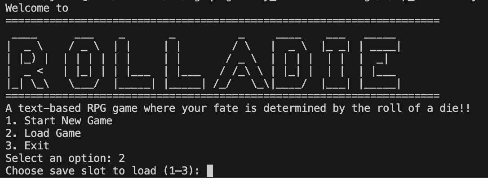
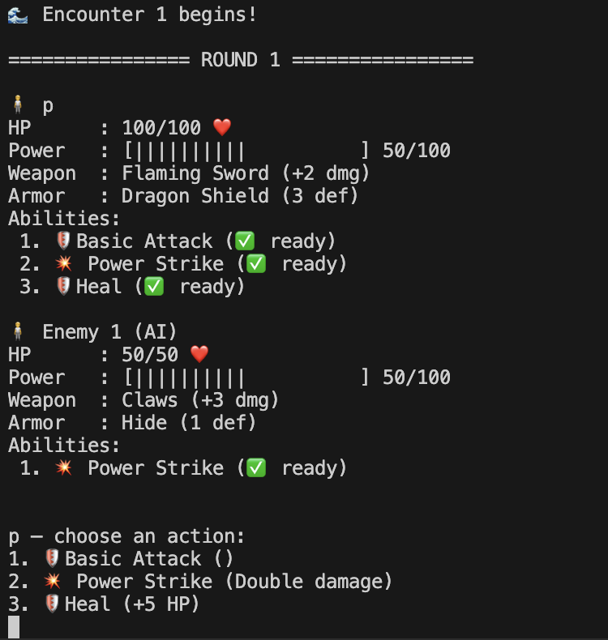
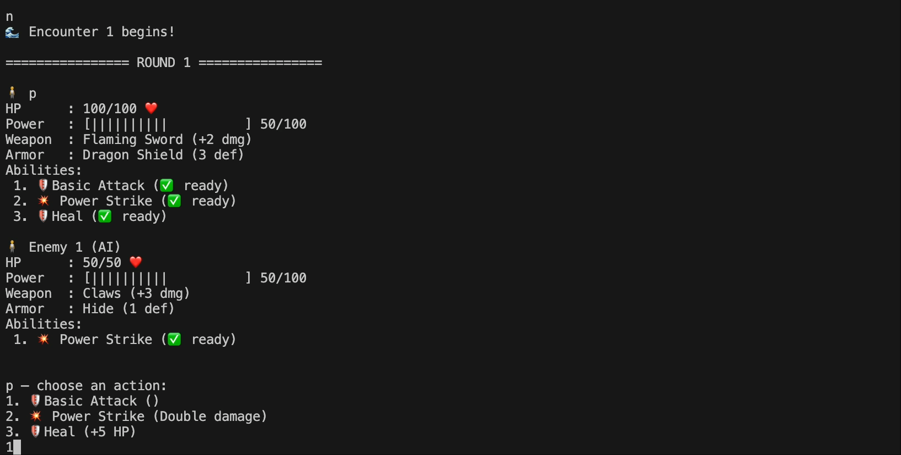
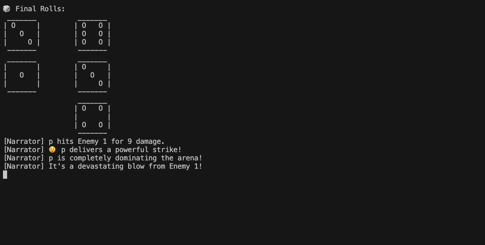
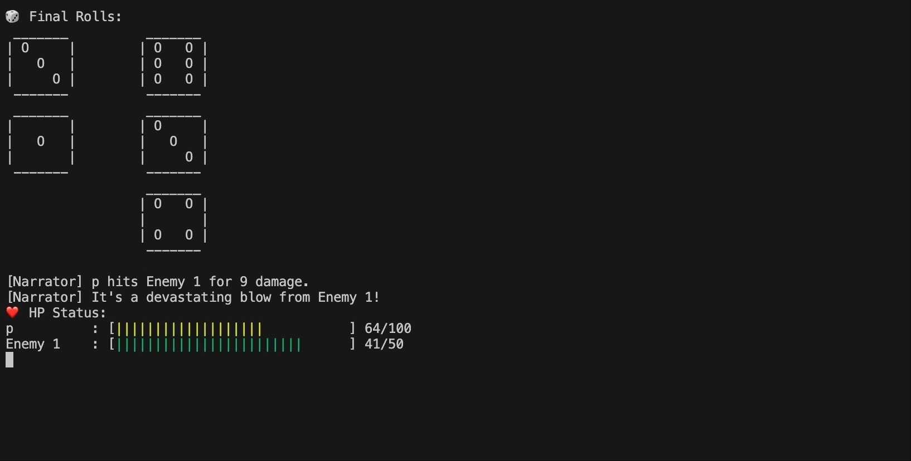
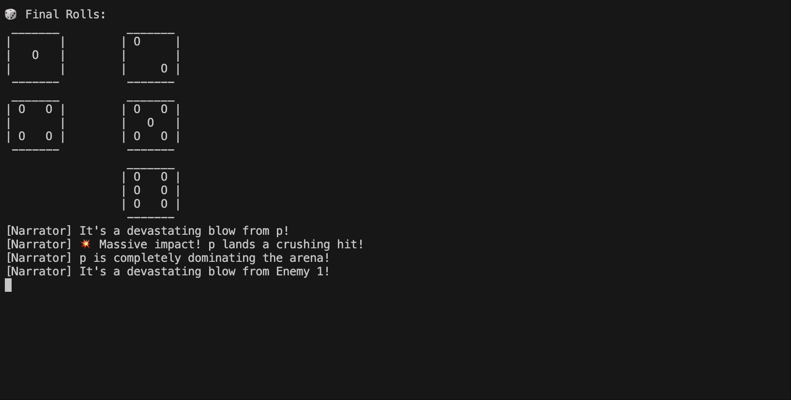
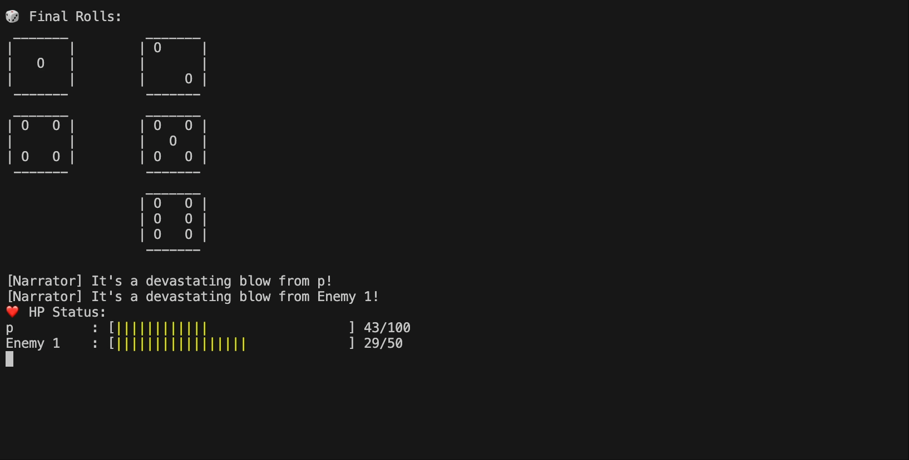

# RollaDie User Guide

## Table of content

- [Introduction](#introduction)

- [Quick Start](#quick-start)

- [Features](#features)

- [1. Starting a new game](#starting-a-new-game)

- [2. Loading from a save](#loading-from-a-save)

- [3. Making your character](#making-your-character)

- [4. Choosing your battle ability](#choosing-your-battle-ability)

- [5. Looting the enemy](#looting-the-enemy)

- [6. Purchasing from the shop](#purchasing-from-the-shop)

- [7. Saving the game](#saving-the-game)

- [8. Exiting the game](#exiting-the-game)

- [Command Summary](#command-summary)

- [FAQ](#faq)

## Introduction

RollaDie is a Dungeon & Dragons (DnD) text-based RPG, optimised to play using Command Line Interface (CLI) and has a simple text-ui display that reminisces games of the 1960s. Players face off hordes of enemies with the ultimate goal of achieving the legendary status in the annals of history. Join the story and learn the secrets that lay within!

The target audience of this program are CS2113 students, but everyone is invited! It serves primarily as a stress reliever, and it aims to provide a dynamic and replay-able experience!

## Quick Start

1. Ensure that you have Java 17 installed.

2. Download the latest version of `Rolladie` from [here](https://github.com/AY2425S2-CS2113-T13-4/tp/releases/).

3. From the folder containing the downloaded JAR file, run the following command in your terminal to start the game:
- `java -jar ./rolladie.jar`

## Features

> [!NOTE]
> The dice outcome listed below are randomly generated, meaning the results will vary each time. As a result, the damage calculation will depend highly on the situation and can only be used as a reference

### Starting a new game

  

Upon first launch, input `1` to start a new game.
### Loading from a save

To load from a previous save, input `2`.

You can choose the specific save slot to load from. Select your choice and begin!
### Making your character

If starting from a new game, the game will then ask you for your hero's name. Choose a name and type it in!
### Choosing your battle ability

The game presents the round number (aka the bout number with the current opponent), your player stats, and the current enemy stats below.

Let's break it down:
`p` is our hero's name and he has 100 Hit Points (HP). Our player has 50 Power (out of a max possible 100), akin to mana that you encounter in other games of similar genre. The Weapon is an equipment that boosts your damage stats, while the Armor increases your durability. Below, we see our hero has three abilities he can use, namely Basic Attack, Power Strike and Heal.

The enemy is mostly similar in makeup, but this one has 50 Hit Points and a different Weapon and Armor. You can see how the equipment affects each player differently during combat. He has only one ability, Power Strike. Generally, the AI will intelligently choose its ability based on the situation. However, when the AI has no valid moves available, it will default to use a Basic Attack.

Select the ability you want to use for the round. Note that each ability comes with different costs (Power cost, Cooldown cost) and you will need to strategise well to survive!

#### Battle sequence

In this example, we begin with using the Basic Attack ability.

The game proceeds to roll both players' dice, with your hero's dice shown on the left and the opponent's shown on the right. The rolled value is critical in the calculation of the final damage dealt to each player. Here, you are looking for a high value.

An animation plays out to visually represent the changes to Hit Points at the present turn. The bar changes colour depending on the status of your character.

In the next turn, you will see the changes to the player stats at the top, any ability cooldown related blockers will be shown with a turn counter.

The narrator will announce the effects of your attacks, as well as those of your opponents.

Here, the game continues the battle until one of the players is down. If the player survives into the next encounter, he/she may be awarded a new skill and be able to loot from the fallen opponent.
#### Strategizing for a win

There are various strategies to thriving in the world of RollaDie. Careful planning of your skills to leverage on each of their strengths is crucial in maintaining the upper edge in each encounter.

The damage calculation is as follows:
\[(dice roll result) + (num of dice) * (weapon bonus)] * \[(power) / (max power) * 0.5 * (ability damage multiplier)] - (opponent armor defense)

To break it down further:
- The number of dice impacts your damage calculation two-fold, the total roll result, as well as the weapon bonus per die rolled.
- The available amount of power you have scales your damage output up to a total of 50%.
- The used ability has an innate damage multiplier that will drastically change the total damage output.
- Finally, the equipped armor and player's defense stat will have a fixed damage reduction bonus applied on top.
### Looting the enemy

After every battle, there will be a loot event!
If you defeated the enemy, the loot event will grant you gold.
If you fled from the enemy, no gold for you!

### Purchasing from the shop

Every 2 waves, the player will be able to purchase Equipment from the Shop. These Equipment consists of Armor, Boots, Weapon. They improve the stats of the the player, so that the player can potentially defeat stronger and stronger enemies.

After buying or selling equipment, the players new equipment and stats will be shown.

### Saving the game

The game will periodically ask you to save the game at checkpoints. Type `y` when prompted to save and `n` to skip through. Specify a save slot (1-3) to save multiple progresses and return to them when necessary!

### Exiting the game

At any point in the game when it asks for input, you can insert the command, `exit`, to quit the game. Do note however, that any unsaved progress will be lost!

### Game Rounds

The total number of battle rounds is 10. The goal is to win the 10th round of the game to beat the game.

## Command Summary

There are no commands to remember. Simply follow and let the game guide you along!

| Function             | Scenario    | Input                                          |
|----------------------|-------------|------------------------------------------------|
| Starting a new game | In main menu | `1` |
| Loading a previous save | In main menu | `2` |
| Creating a new character | In character screen | {your_hero_name} |
| Choosing your battle ability | In combat | Integer corresponding to your choice of ability {1..*} |
| Saving the game | At checkpoints | Input `y` and choose a slot number {1-3} |

## FAQ

**Q: How do I transfer my data to another computer?**

A: Copy the `.dat` files created in the same directory over to the other computer you wish to continue your save from.

**Q: What happens if I enter invalid input?**

A: The game will not accept the input and will prompt for another valid one.

**Q: What is the difference between HP, Power and Cooldown?**

A: Remaining HP is a measure of your character's durability against incoming damage. When HP falls to zero, your character also falls. Power acts like mana as seen frequently in other games of such genre, in that it is an ability casting requirement to prevent skill spamming, but also gives you a damage boost the more you stack it. So it helps add strategic depth. Cooldown applies to individual skills so that players are forced to choose their combat sequence tactically for the best outcome.

**Q: What happens if I close the application without using the `exit` command?**

A: Any previously saved progress will remain available. However, if there are any progress made between the point of exit and the point of last save, then those progress will be lost.